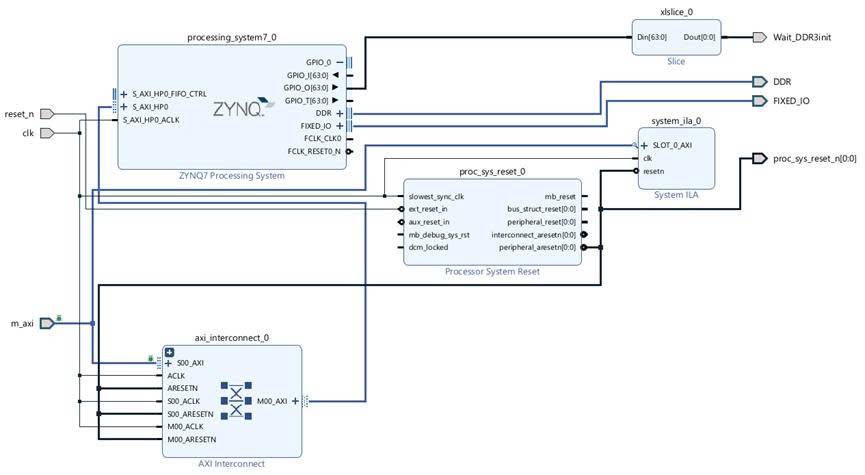
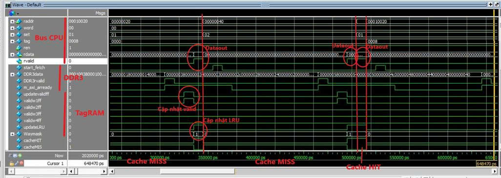

# ICache_FPGA
Dự án là mô tả phần cứng triển khai cache lệnh sử dụng ánh xạ tập kết hợp, phương pháp thay thế dòng cache ít được sử dụng gần đây nhất(LRU), kiến trúc cache look through. Miễn sao bộ nhớ chính hỗ trợ bus AXI4 full thì đều có thể ghép vào dự án này. 

Thông số cache là cache line 32B, 4 way, dung lượng cache 32KB, kích thước bộ nhớ chính 512MB. Đối với kích thước bộ nhớ chính có thể tùy ý miễn sao địa chỉ 32bit nếu không sẽ cần chỉnh sửa mã nguồn một chút phần độ rộng địa chỉ truy cập.

Với cache line là 32Byte vậy cần 5 bit word biểu diễn địa chỉ của từ trong line, bộ nhớ cache có dung lượng 32KB và chi là 4 way tức là mỗi way là 8KB. Kết hợp với kích thước line 32Byte ta suy ra được mỗi way có 256 line. Vậy cần 8 bit set địa chỉ dòng trong đường. Bộ nhớ chính có dung lượng 512MB tức là cần 29bit địa chỉ để biểu diễn cho bộ nhớ chính. Áp dụng kết quả tính toán trên ta có được Tag cần 16 bit để biểu diễn.

Cấu trúc cache gồm 3 phần, thứ nhất là Cache controller, thứ hai là TagRAM và cuối cùng là SRAM. Cache controller quản lý sự kiện HIT, MISS, đưa ra các yêu cầu đối với SRAM và TagRAM đồng thời nó cũng truy cập vào bộ nhớ chính DDR3 khi sự kiện MISS xảy ra. SRAM là nơi lưu dữ liệu các dòng nhớ trong cache. TagRAM lưu Tag của line chứa trong từng way của cache đỉ chỉ ra line đó thuộc page nào trong bộ nhớ chính, đồng thời nó cũng dữ các cờ valid chỉ ra dữ liệu có hợp lệ hay không và 3 bit phục vụ cho việc tìm ứng viên bị thay thế LRU.

SRAM bao gồm 4 way mỗi way 8KB và cung cấp độ rộng bus dữ liệu lên tới 256 bit tương đương 32B bằng với một dòng cache. Sử dụng 8 khối block ram mỗi khối cung cấp bus dữ liệu 32bit ghép vào để đạt được độ rộng bus dữ liệu mỗi chu kì là 256bit

TagRAM bao gồm 4 khối block ram có độ rộng dữ liệu mỗi khối là 16bit lưu set của mỗi line. Cache truy cấp nó và đọc ra set sẽ biết line đó đang ánh xạ tới page nào của bộ nhớ chính từ đó phục vụ cho việc xác định sự kiện HIT hay MISS. Bên cạch đó TagRAM còn chứa 1 bộ nhớ LUTRAM chứa 256 thanh ghi mỗi thanh 7 bit chứa 4 bit valid cho 4 way và 3 bit LRU.

## Ví dụ cache với bộ nhớ chính là DDR3 của chíp FPGA SoC XC7Z020clg400.
Đối với chính SoC FPGA đó bộ nhớ DDR3 được quản lý bằng core ARM(PS) trên board. Mọi hoạt động đọc ghi DDR3 đều phải thông qua core PS này. Trong dự án này Icache giao tiếp với PS bằng bus AXI4 full với kết nối như sau:

  
   
  <i>Hình 1: Block Design giao tiếp DDR3 board SoC XC7Z020clg400</i>

- Trong khối trên processing_system7_0 là bộ xử lý ARM Cortex-A9 trong Zynq. Nó sở hữu bộ điều khiển DDR3, các cổng AXI của PS (GP / HP / ACP...). PS quản lý DDR3 vật lý và cung cấp các cổng AXI để truy cập/mapping DDR vào PL. Nói cách khác PS chính là người quản lý của DDR3, PL muốn đọc ghi DDR3 thì phải thông qua PS. Trong sơ đồ khối trên bus hiệu suất cao AXI của ps được nối với bus M00_AXI của AXI interconnect và được điều khiển bằng bus m_axi. Bus m_axi thực chất là một bó dây được kết nối với module Verilog trong bộ quản lý cache. Nói cách khác mỗi khi bộ quản lý cache cần truy cập DDR3 nó sẽ gửi yêu cầu thông quan bus m_axi và tới S_AXI_HP0 của PS, PS thực hiện đọc DDR3 và gửi dữ liệu trở lại cho bộ quản lý cache.
- Processor system reset là một bộ quản lý reset nhận vào clock và yêu cầu reset, đưa ra tín hiệu reset đồng bộ cho toàn bộ hệ thống. Tín hiệu này cũng được nối ra một port để cung cấp reset cho toàn bộ thiết kế CPU bên PL tức FPGA. Điều này giúp 2 miền PL và PS đồng bộ reset với nhau tránh nhiều vấn đề phát sinh.
- Khối System ILA là một khối IP có sẵn cung cấp chức năng quan sát tín hiệu thực tế trong quá trình hoạt động. Ở đây nó được kết nối tới bus m_axi để quan sát quá trình đọc DDR3.
- Khối Slide mục đích chỉ để lấy bit cuối của GPIO_0 out – một tín hiệu điều khiển gửi cho CPU biết cache đã được khởi tạo xong chưa. Mục đích chính của việc này để chờ DDR3 được ghi mã lệnh trược rồi mới cho CPU hoạt động tránh đọc giá trị rác.

## Mô phỏng

  
   
  <i>Hình 2: Hình ảnh mô phỏng cacheHIT và cache MISS</i>

